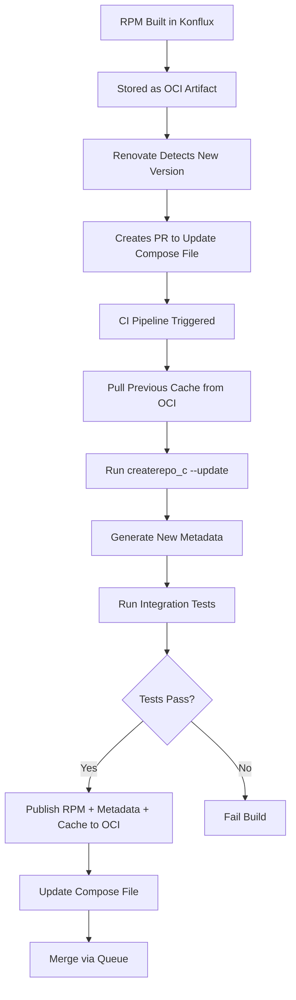
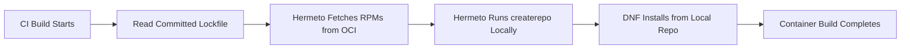
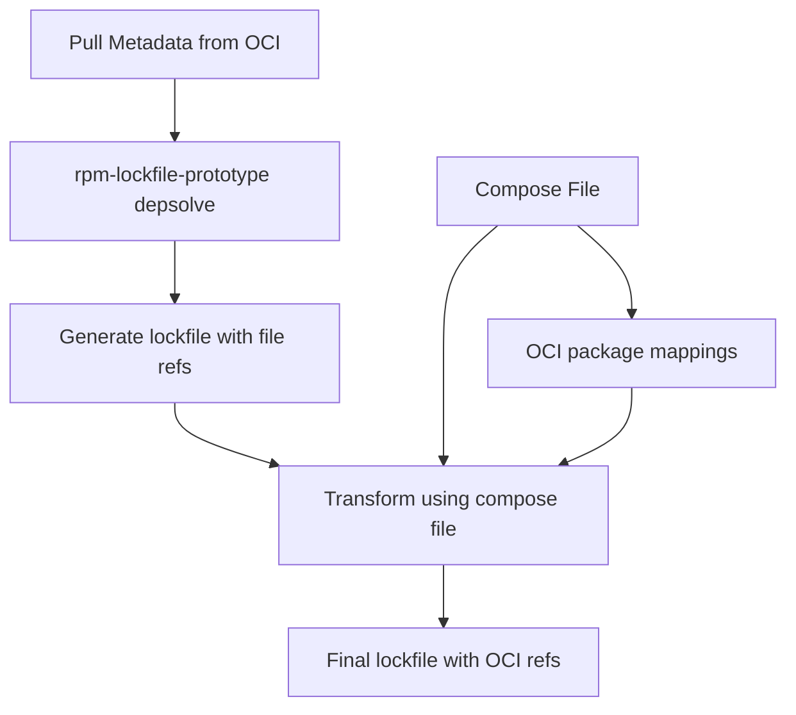

# OCI-Based RPM Compose System Design

## Overview

This system enables on-demand creation of RPM "composes" - curated sets of RPM packages with DNF metadata - using OCI artifacts for storage and modern CI/CD practices for updates.

## Goals

- Enable incremental testing of individual RPM updates within compose contexts
- Support multiple conflicting package versions (e.g., different GCC toolchains)
- Provide hermetic, reproducible builds using DNF repositories
- Leverage OCI registries for artifact storage and distribution

## Architecture Components

### Core Components

**Compose Definition**: Text file mapping RPM names to OCI artifact locations and versions
**DNF Metadata**: Standard createrepo-generated metadata (repomd.xml, primary.xml.gz, etc.)
**Cache Artifacts**: createrepo cache directories stored as OCI artifacts for incremental updates
**Integration Pipeline**: CI system handling updates, testing, and promotion

### External Dependencies

- **Konflux-ci**: Builds and publishes RPMs as OCI artifacts
- **Renovate**: Monitors RPM versions and creates update PRs
- **rpm-lockfile-prototype**: Generates lockfiles for dependency resolution
- **Hermeto**: Fetches dependencies for hermetic builds
- **createrepo_c**: Generates DNF repository metadata

## System Flow



## Compose File Format

```yaml
apiVersion: v1
kind: Compose
metadata:
  name: rhel9-gcc13-latest
spec:
  packages:
    httpd:
      version: "2.4.57"
      oci_ref: "oci://quay.io/konflux/rpms/httpd:2.4.57"
    gcc:
      version: "13.2.0"
      oci_ref: "oci://quay.io/konflux/rpms/gcc:13.2.0"
  metadata:
    location: "oci://quay.io/konflux/metadata/rhel9-gcc13:v1.2.3"
    cache_location: "oci://quay.io/konflux/cache/rhel9-gcc13:v1.2.3"
```

## Metadata Generation Pipeline

### Initial Compose Creation
1. Start with empty cache directory
2. Run `createrepo_c --cachedir /tmp/cache /repo` (full generation)
3. Publish metadata and cache as OCI artifacts
4. Update compose file with artifact references

### Incremental Updates
1. Pull existing cache from OCI registry
2. Run `createrepo_c --update --cachedir /cache /repo`
3. Only processes changed/new RPMs (typically seconds vs minutes)
4. Test metadata with integration suite
5. Publish updated metadata and cache if tests pass

### Cache Management
- Each compose maintains separate cache (no sharing between composes)
- Cache size: ~3-10 MB for 1000 RPMs
- Cache artifacts versioned alongside metadata
- Merge queue prevents concurrent cache corruption

## Consumption Workflow

The consumption process consists of two distinct phases:

### Phase 1: Lockfile Generation (Development Time)

Performed by developers/maintainers and committed to source control:


### Phase 2: Hermetic Build Execution (CI Pipeline)

Performed automatically during container builds:



## Key Design Decisions

### Cache as Artifact
Store createrepo cache directories as OCI artifacts to enable:
- Reproducible incremental metadata generation
- Atomic promotion of RPM + metadata + cache
- Rollback capability to any previous state

### Merge Queue Sequencing
Process all compose updates sequentially to prevent:
- Cache corruption from concurrent modifications  
- Lost updates from parallel builds using stale cache
- Inconsistent metadata states

### No Cross-Compose Sharing
Each compose maintains independent cache and metadata to:
- Avoid complex dependency tracking between composes
- Enable independent testing and promotion
- Simplify rollback and debugging

## Storage Requirements

| Component | Size (1000 RPMs) | Transfer Time |
|-----------|------------------|---------------|
| Cache Directory | 3-10 MB | 1-3 seconds |
| DNF Metadata | 1-3 MB | <1 second |
| Individual RPM | 1-50 MB | 1-10 seconds |

## Error Handling

- **Cache corruption**: Fall back to full metadata rebuild
- **Integration test failure**: Block promotion, retain previous version
- **OCI artifact unavailable**: Fail build with clear error message
- **Concurrent builds**: Merge queue rejects conflicting updates

## OCI-DNF Integration Solution

### Dependency Resolution Process

The system bridges traditional DNF tooling with OCI artifact storage through a three-stage process:

1. **Metadata Expansion**: Pull DNF metadata from OCI registry and expand locally
2. **Dependency Resolution**: Use rpm-lockfile-prototype against local metadata 
3. **Reference Transformation**: Map resolved packages to OCI locations using compose file

### Implementation Flow



### Transformation Logic

rpm-lockfile-prototype generates standard lockfiles with file references:

```yaml
# Initial lockfile output
packages:
  - name: httpd
    version: 2.4.57
    source: "file:///repo/httpd-2.4.57.rpm"
  - name: httpd-tools  
    version: 2.4.57
    source: "file:///repo/httpd-tools-2.4.57.rpm"
```

Post-processing transforms these to OCI references using the compose file:

```yaml
# Final lockfile with OCI references
packages:
  - name: httpd
    version: 2.4.57
    source: "oci://quay.io/konflux/rpms/httpd:2.4.57"
  - name: httpd-tools
    version: 2.4.57  
    source: "oci://quay.io/konflux/rpms/httpd-tools:2.4.57"
```

### Error Handling

This approach enables validation during transformation:
- **Missing packages**: Resolved dependency not found in compose file
- **Version mismatches**: Resolved version differs from compose version
- **Invalid OCI references**: Can verify OCI locations exist before generating final lockfile

### Future Enhancement

The transformation logic could be integrated directly into rpm-lockfile-prototype to:
- Accept compose file as additional input parameter
- Generate lockfiles with OCI references natively
- Eliminate need for separate post-processing step

### Open Questions

**Transitive dependency handling**: When DNF resolves dependencies not explicitly listed in the compose file, the system needs a strategy to map them to OCI locations. Options include:
- Requiring all transitive dependencies in compose (explicit but verbose)
- Using naming conventions to generate OCI references
- Maintaining separate base package registry for common dependencies

## Implementation Update: OCI Index Support

**oras Version Upgrade**: Upgraded from v1.2.3 to v1.3.0-beta.4

### New Capabilities ✅
- **`--artifact-platform` flag**: Enables creation of true OCI Image Indexes (multi-arch manifests)
- **Platform-aware publishing**: Can push same artifact to multiple architectures under single tag

### Updated Compose File Format
With OCI Index support, the original design is now achievable:

```yaml
# Clean single-tag approach (preferred)
packages:
  bash:
    version: "5.3.0-2.fc43"
    oci_ref: "oci://quay.io/bcook/rpms:bash-5.3.0-2.fc43"  # auto-resolves architecture
```

### Implementation Process
The OCI Image Index creation requires a multi-step process:

```bash
# Step 1: Push each architecture to temporary tags
oras push quay.io/bcook/rpms:bash-temp-amd64 bash.x86_64.rpm --artifact-type application/vnd.rpm
oras push quay.io/bcook/rpms:bash-temp-arm64 bash.aarch64.rpm --artifact-type application/vnd.rpm

# Step 2: Create OCI Image Index manifest
cat > index.json << EOF
{
  "schemaVersion": 2,
  "mediaType": "application/vnd.oci.image.index.v1+json",
  "manifests": [
    {
      "mediaType": "application/vnd.oci.image.manifest.v1+json",
      "digest": "sha256:...",
      "platform": {"architecture": "amd64", "os": "linux"}
    },
    {
      "mediaType": "application/vnd.oci.image.manifest.v1+json", 
      "digest": "sha256:...",
      "platform": {"architecture": "arm64", "os": "linux"}
    }
  ]
}
EOF

# Step 3: Push the index manifest to final tag
oras manifest push quay.io/bcook/rpms:bash-5.3.0-2.fc43 index.json
```

**Result**: Single tag `quay.io/bcook/rpms:bash-5.3.0-2.fc43` containing OCI Image Index that automatically resolves to correct architecture when pulled with `--platform linux/amd64` or `--platform linux/arm64`.

This approach removes the need for architecture-specific tag management in compose files and lockfile transformation logic.